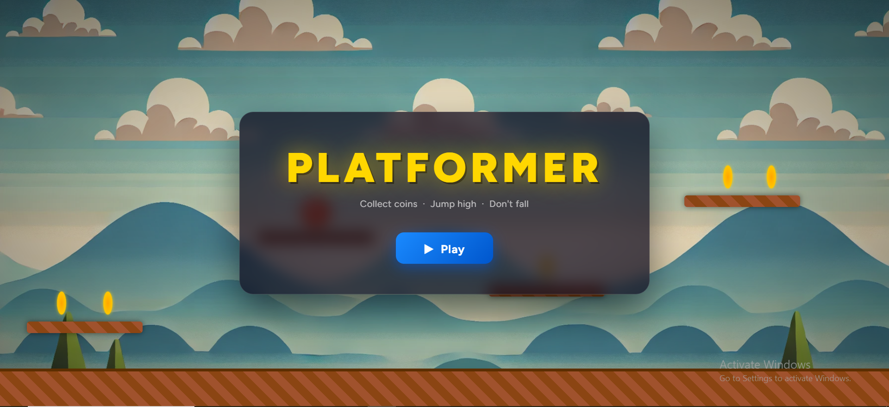
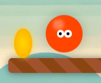
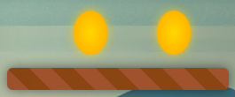

# Platformer

A browser-based 2D platformer where you jump across platforms and collect coins.

## Gameplay

Navigate your character across a scrolling world of platforms, collecting every coin you can reach. The ground is always below you — but the platforms aren't.

### Controls

| Key | Action |
|-----|--------|
| `→` Arrow Right | Move right |
| `←` Arrow Left | Move left |
| `Space` | Jump |

## Objective

Collect as many coins as possible. Your score is tracked live in the top corner of the screen.

## Running the Game

Open `index.html` in any modern browser. No build step or server required.

> Background music plays automatically once the audio is ready. Make sure your browser allows audio autoplay, or interact with the page first.
